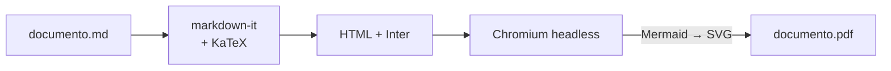
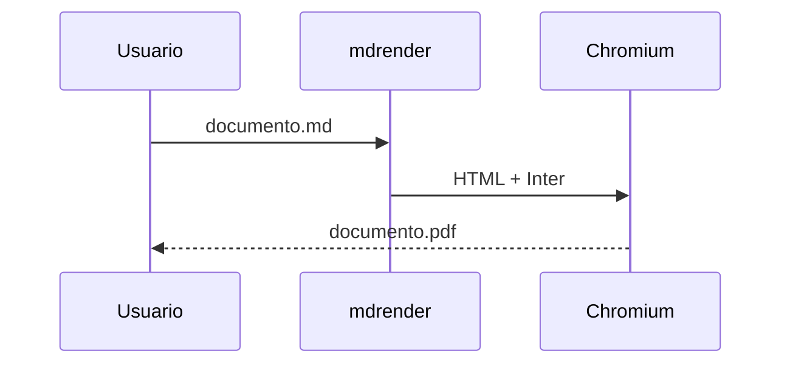

# MD_reder

**Renderiza archivos Markdown (`.md`) a PDF desde la línea de comandos — en Windows y Linux.**
Con soporte para ecuaciones LaTeX, diagramas Mermaid y tipografía [Inter](https://fonts.google.com/specimen/Inter).

> ⚠️ **Estado: pre-alfa (Fase 3 completa).** Convierte Markdown (GFM, código resaltado,
> imágenes, notas al pie, alertas), **ecuaciones LaTeX** y **diagramas Mermaid** a PDF y HTML
> con Inter, con encabezado/pie, tabla de contenidos y front matter. Las opciones marcadas con
> † aún no están implementadas. Consulta el [Plan maestro](docs/PLAN_MAESTRO.md).

---

## Características

- 📄 **Markdown → PDF** con un solo comando (también exporta HTML autocontenido).
- ➗ **Ecuaciones** en línea `$E = mc^2$` y en bloque `$$ ... $$`, renderizadas con KaTeX.
- 📊 **Diagramas Mermaid**: flujo, secuencia, clases, estados, ER, Gantt, pie, mindmap…
- 🔤 **Tipografía Inter** (Google Fonts) incrustada en el PDF; JetBrains Mono para código.
- 🧩 **GFM**: tablas, listas de tareas, tachado, notas al pie, resaltado de sintaxis.
- 🖨️ Tamaño de página, márgenes, orientación, encabezado/pie y números de página.
- 📚 Tabla de contenidos opcional y marcadores en el PDF.
- 🔌 **Funciona offline**: fuentes, KaTeX y Mermaid van empaquetados.
- 💻 **Multiplataforma**: Windows 10/11 y Linux (x64).

## Cómo funciona



El Markdown se convierte a HTML (las ecuaciones se renderizan con KaTeX), se aplica una
plantilla con la fuente Inter y se abre en un Chromium sin interfaz, donde Mermaid dibuja
los diagramas. Finalmente la página se imprime a PDF.

## Requisitos

- **Node.js 22.12+** (solo para instalar vía npm; los ejecutables independientes no lo necesitan).
- Un navegador basado en Chromium: **Microsoft Edge** (incluido en Windows 10/11),
  **Google Chrome**, **Chromium** o **Brave**. Se detecta automáticamente; también puedes
  indicarlo con `--browser <ruta>` o la variable de entorno `MDRENDER_BROWSER`.
  (`mdrender setup` para descargar uno llegará en la Fase 5.)

## Instalación (planificada)

```bash
# Con npm (Windows y Linux)
npm install -g mdrender

# O sin instalar
npx mdrender documento.md
```

También se publicarán ejecutables independientes para `win-x64` y `linux-x64` en
[Releases](../../releases).

### Desde el código fuente

```bash
git clone https://github.com/imontene/MD_reder.git
cd MD_reder
npm install
npm run build
npm link        # deja disponible el comando `mdrender`
```

## Uso

```bash
# Básico: genera documento.pdf junto al .md
mdrender documento.md

# Elegir salida, tamaño de página y tabla de contenidos
mdrender documento.md -o salida/informe.pdf --page-size Letter --toc

# Exportar a HTML
mdrender documento.md --format html

# Convertir todos los .md de una carpeta
mdrender docs/ -o pdf/

# Regenerar automáticamente al guardar
mdrender documento.md --watch
```

En Windows (PowerShell o CMD) los comandos son idénticos:

```powershell
mdrender "C:\Users\yo\Documentos\notas de clase.md" -o "C:\Users\yo\Desktop\notas.pdf"
```

### Opciones principales

| Opción                     | Descripción                                                | Por defecto        |
| -------------------------- | ---------------------------------------------------------- | ------------------ |
| `-o, --output <ruta>`      | Archivo o carpeta de salida                                | junto al `.md`     |
| `-f, --format <pdf\|html>` | Formato de salida                                          | `pdf`              |
| `--page-size <tamaño>`     | `A3`, `A4`, `A5`, `Letter`, `Legal`, `Tabloid`             | `A4`               |
| `--margin <valor>`         | Márgenes como en CSS: `20mm`, `15mm 20mm`, `1in 0.75in`…   | `20mm`             |
| `--landscape`              | Orientación horizontal                                     | —                  |
| `--toc`                    | Tabla de contenidos al inicio (o donde pongas `[[toc]]`)   | —                  |
| `--toc-depth <n>`          | Nivel de título más profundo en la tabla de contenidos     | `3`                |
| `--header <texto>`         | Encabezado de página (ver abajo)                           | —                  |
| `--footer <texto>`         | Pie de página (ver abajo)                                  | `{page} / {pages}` |
| `--no-page-numbers`        | Sin el pie con números de página                           | —                  |
| `--css <archivo.css>`      | CSS adicional (se puede repetir)                           | —                  |
| `--mermaid-theme <tema>`   | `default`, `neutral`, `dark`, `forest`, `base`             | `neutral`          |
| `--lang <código>`          | Idioma del documento; `en` para inglés (`pt`, `fr`, `de`…) | `es`               |
| `--title <texto>`          | Título del documento (muestra un bloque de título)         | primer `# título`  |
| `--config <archivo>`       | Archivo de configuración                                   | el más cercano     |
| `--no-config`              | Ignorar `mdrender.config.json`                             | —                  |
| `--browser <ruta>`         | Ruta a Chrome/Edge/Chromium                                | autodetección      |
| `--theme <light\|dark>` †  | Tema visual                                                | `light`            |
| `-w, --watch` †            | Regenerar al guardar                                       | —                  |

**Encabezado y pie**: texto con marcadores `{page}`, `{pages}`, `{title}`, `{author}` y
`{date}`; `|` separa columnas izquierda, centro y derecha. Ejemplos:
`--header "{title} | | {date}"`, `--footer "Confidencial | {page} de {pages}"`.

### Front matter y configuración

Las mismas opciones pueden ir en un bloque YAML al inicio del `.md` o en un archivo
`mdrender.config.json` (se busca junto al `.md` y en las carpetas superiores). Prioridad:
**línea de comandos > front matter > archivo de configuración > valores por defecto**.

```markdown
---
title: Informe técnico
subtitle: Resultados del trimestre
author: Ana Pérez
date: 2026-10-04
lang: es
toc: true
page-size: Letter
header: "{title} | | {date}"
---
```

```json
{
  "lang": "es",
  "pageSize": "A4",
  "margin": "25mm 20mm",
  "css": "estilos/empresa.css"
}
```

Con `title` en el front matter se muestra un bloque de título (título, subtítulo, autor y
fecha). Las rutas de `css` son relativas al archivo donde aparecen.

### Más Markdown

- **Resaltado de código** para ~35 lenguajes comunes (` ```ts `, ` ```python `, ` ```bash `…).
- **Alertas** estilo GitHub: `> [!NOTE]`, `[!TIP]`, `[!IMPORTANT]`, `[!WARNING]`,
  `[!CAUTION]`, con el título traducido según `lang`.
- **Notas al pie**: `Texto[^1]` y `[^1]: La nota.`
- **Marcadores del PDF** generados a partir de los títulos, y PDF etiquetado (accesible).

## Ecuaciones y diagramas

| Sintaxis                          | Resultado                               |
| --------------------------------- | --------------------------------------- |
| `$e^{i\pi}+1=0$`                  | Ecuación en línea                       |
| `$$ ... $$` (una o varias líneas) | Ecuación en bloque, centrada            |
| ` ```math `                       | Ecuación en bloque (sintaxis de GitHub) |
| ` ```mermaid `                    | Diagrama Mermaid, incrustado como SVG   |

- Las fórmulas se dibujan con [KaTeX](https://katex.org/docs/supported) (soporta `aligned`,
  `matrix`, `cases`, `\def`, `\newcommand`…). Las macros valen para todo el documento.
- `Cuesta $5 y $10` no se interpreta como fórmula; para un `$` literal usa `\$`.
- Diagramas soportados: flujo, secuencia, clases, estados, entidad-relación, Gantt, torta,
  mapa mental y el resto de tipos de [Mermaid](https://mermaid.js.org/intro/).
- Si una fórmula o diagrama tiene un error, el documento se genera igual con una caja roja en
  su lugar, se informa `error: archivo.md:LÍNEA: mensaje` y el comando termina con código `2`.

## Ejemplo de documento

````markdown
---
title: Informe de ejemplo
author: Ivan
---

# Introducción

La identidad de Euler, $e^{i\pi} + 1 = 0$, relaciona cinco constantes.

$$
\int_{-\infty}^{\infty} e^{-x^2}\,dx = \sqrt{\pi}
$$



| Fase | Estado |
| ---- | ------ |
| MVP  | ⏳     |
````

## Desarrollo

Requisitos: Node.js 22.12+ y npm.

```bash
npm install          # instalar dependencias
npm run dev -- --help   # ejecutar la CLI desde el código fuente (tsx)
npm test             # pruebas (Vitest)
npm run lint         # ESLint
npm run typecheck    # TypeScript sin emitir
npm run format       # Prettier
npm run check        # todo lo anterior, igual que en CI
npm run build        # compila a dist/
```

El CI (GitHub Actions) ejecuta `npm run check` y `npm run build` en **Windows y Linux**
con Node 22 y 24 en cada pull request.

| Código de salida | Significado                                    |
| ---------------- | ---------------------------------------------- |
| `0`              | Éxito                                          |
| `1`              | Error de uso (argumentos, archivo inexistente) |
| `2`              | Error de renderizado                           |
| `3`              | Navegador no encontrado                        |

## Hoja de ruta

| Fase | Contenido                                                | Estado       |
| ---- | -------------------------------------------------------- | ------------ |
| 0    | Fundaciones: plan, README, proyecto TS, CI Windows/Linux | ✅           |
| 1    | MVP Markdown → PDF con Inter                             | ✅           |
| 2    | Ecuaciones (KaTeX) y diagramas Mermaid                   | ✅           |
| 3    | Resaltado, encabezado/pie, TOC, front-matter, HTML       | ✅           |
| 4    | Lotes, `--watch`, vista previa, temas                    | 🟡 siguiente |
| 5    | Distribución: npm, ejecutables, GitHub Releases          | ⬜           |
| 6    | Endurecimiento y v1.0                                    | ⬜           |

Detalle completo en [docs/PLAN_MAESTRO.md](docs/PLAN_MAESTRO.md).

## Tecnologías

[Node.js](https://nodejs.org) · TypeScript · [markdown-it](https://github.com/markdown-it/markdown-it) ·
[KaTeX](https://katex.org) · [Mermaid](https://mermaid.js.org) ·
[Puppeteer](https://pptr.dev) · [Inter](https://rsms.me/inter/) · [JetBrains Mono](https://www.jetbrains.com/lp/mono/)

## Licencia

Por definir (se propone MIT). La fuente Inter y JetBrains Mono se distribuyen bajo
[SIL Open Font License 1.1](https://openfontlicense.org).
