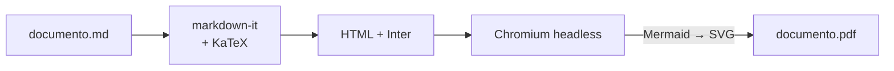
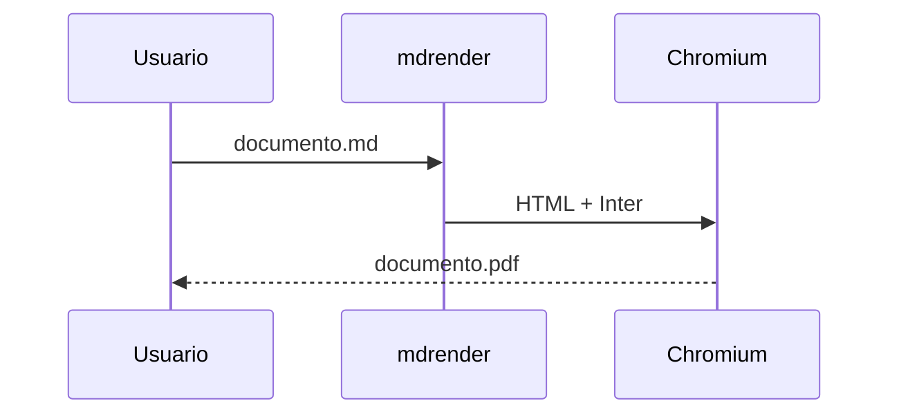

# MD_reder

**Renderiza archivos Markdown (`.md`) a PDF desde la línea de comandos — en Windows y Linux.**
Con soporte para ecuaciones LaTeX, diagramas Mermaid y tipografía [Inter](https://fonts.google.com/specimen/Inter).

> ⚠️ **Estado: en planificación (pre-alfa).** Las funciones descritas abajo representan el
> objetivo de la versión 1.0. Consulta el [Plan maestro](docs/PLAN_MAESTRO.md) para ver el
> avance por fases.

---

## Características

- 📄 **Markdown → PDF** con un solo comando (también exporta HTML autocontenido).
- ➗ **Ecuaciones** en línea `$E = mc^2$` y en bloque `$$ ... $$`, renderizadas con KaTeX.
- 📊 **Diagramas Mermaid**: flujo, secuencia, clases, estados, ER, Gantt, pie, mindmap…
- 🔤 **Tipografía Inter** (Google Fonts) incrustada en el PDF; JetBrains Mono para código.
- 🧩 **GFM**: tablas, listas de tareas, tachado, notas al pie, resaltado de sintaxis.
- 🖨️ Tamaño de página, márgenes, orientación, encabezado/pie y números de página.
- 📚 Tabla de contenidos opcional y marcadores en el PDF.
- 🔌 **Funciona offline**: fuentes, KaTeX y Mermaid van empaquetados.
- 💻 **Multiplataforma**: Windows 10/11 y Linux (x64).

## Cómo funciona



El Markdown se convierte a HTML (las ecuaciones se renderizan con KaTeX), se aplica una
plantilla con la fuente Inter y se abre en un Chromium sin interfaz, donde Mermaid dibuja
los diagramas. Finalmente la página se imprime a PDF.

## Requisitos

- **Node.js 22.12+** (solo para instalar vía npm; los ejecutables independientes no lo necesitan).
- Un navegador basado en Chromium: **Microsoft Edge** (incluido en Windows 10/11),
  **Google Chrome** o **Chromium**. Si no tienes ninguno, ejecuta `mdrender setup`.

## Instalación (planificada)

```bash
# Con npm (Windows y Linux)
npm install -g mdrender

# O sin instalar
npx mdrender documento.md
```

También se publicarán ejecutables independientes para `win-x64` y `linux-x64` en
[Releases](../../releases).

### Desde el código fuente

```bash
git clone https://github.com/imontene/MD_reder.git
cd MD_reder
npm install
npm run build
npm link        # deja disponible el comando `mdrender`
```

## Uso

```bash
# Básico: genera documento.pdf junto al .md
mdrender documento.md

# Elegir salida, tamaño de página y tabla de contenidos
mdrender documento.md -o salida/informe.pdf --page-size Letter --toc

# Exportar a HTML
mdrender documento.md --format html

# Convertir todos los .md de una carpeta
mdrender docs/ -o pdf/

# Regenerar automáticamente al guardar
mdrender documento.md --watch
```

En Windows (PowerShell o CMD) los comandos son idénticos:

```powershell
mdrender "C:\Users\yo\Documentos\notas de clase.md" -o "C:\Users\yo\Desktop\notas.pdf"
```

### Opciones principales

| Opción                               | Descripción                            | Por defecto    |
| ------------------------------------ | -------------------------------------- | -------------- |
| `-o, --output <ruta>`                | Archivo o carpeta de salida            | junto al `.md` |
| `-f, --format <pdf\|html>`           | Formato de salida                      | `pdf`          |
| `--page-size <A4\|Letter\|Legal>`    | Tamaño de página                       | `A4`           |
| `--margin <valor>`                   | Márgenes, ej. `20mm` o `15mm 20mm`     | `20mm`         |
| `--landscape`                        | Orientación horizontal                 | —              |
| `--toc`                              | Insertar tabla de contenidos           | —              |
| `--theme <light\|dark\|archivo.css>` | Tema visual                            | `light`        |
| `--css <archivo.css>`                | CSS adicional                          | —              |
| `--mermaid-theme <tema>`             | `default`, `neutral`, `dark`, `forest` | `neutral`      |
| `--no-page-numbers`                  | Ocultar números de página              | —              |
| `--browser <ruta>`                   | Ruta a Chrome/Edge/Chromium            | autodetección  |
| `-w, --watch`                        | Regenerar al guardar                   | —              |

## Ejemplo de documento

````markdown
---
title: Informe de ejemplo
author: Ivan
---

# Introducción

La identidad de Euler, $e^{i\pi} + 1 = 0$, relaciona cinco constantes.

$$
\int_{-\infty}^{\infty} e^{-x^2}\,dx = \sqrt{\pi}
$$



| Fase | Estado |
| ---- | ------ |
| MVP  | ⏳     |
````

## Desarrollo

Requisitos: Node.js 22.12+ y npm.

```bash
npm install          # instalar dependencias
npm run dev -- --help   # ejecutar la CLI desde el código fuente (tsx)
npm test             # pruebas (Vitest)
npm run lint         # ESLint
npm run typecheck    # TypeScript sin emitir
npm run format       # Prettier
npm run check        # todo lo anterior, igual que en CI
npm run build        # compila a dist/
```

El CI (GitHub Actions) ejecuta `npm run check` y `npm run build` en **Windows y Linux**
con Node 22 y 24 en cada pull request.

| Código de salida | Significado                                    |
| ---------------- | ---------------------------------------------- |
| `0`              | Éxito                                          |
| `1`              | Error de uso (argumentos, archivo inexistente) |
| `2`              | Error de renderizado                           |
| `3`              | Navegador no encontrado                        |

## Hoja de ruta

| Fase | Contenido                                                | Estado       |
| ---- | -------------------------------------------------------- | ------------ |
| 0    | Fundaciones: plan, README, proyecto TS, CI Windows/Linux | ✅           |
| 1    | MVP Markdown → PDF con Inter                             | 🟡 siguiente |
| 2    | Ecuaciones (KaTeX) y diagramas Mermaid                   | ⬜           |
| 3    | Resaltado, encabezado/pie, TOC, front-matter, HTML       | ⬜           |
| 4    | Lotes, `--watch`, vista previa, temas                    | ⬜           |
| 5    | Distribución: npm, ejecutables, GitHub Releases          | ⬜           |
| 6    | Endurecimiento y v1.0                                    | ⬜           |

Detalle completo en [docs/PLAN_MAESTRO.md](docs/PLAN_MAESTRO.md).

## Tecnologías

[Node.js](https://nodejs.org) · TypeScript · [markdown-it](https://github.com/markdown-it/markdown-it) ·
[KaTeX](https://katex.org) · [Mermaid](https://mermaid.js.org) ·
[Puppeteer](https://pptr.dev) · [Inter](https://rsms.me/inter/) · [JetBrains Mono](https://www.jetbrains.com/lp/mono/)

## Licencia

Por definir (se propone MIT). La fuente Inter y JetBrains Mono se distribuyen bajo
[SIL Open Font License 1.1](https://openfontlicense.org).
