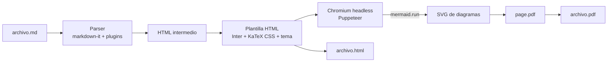

# Plan maestro — MD_reder

> Objetivo: una aplicación de línea de comandos, multiplataforma (Windows y Linux), que
> renderiza archivos Markdown (`.md`) a HTML y PDF exportable, con soporte de
> **ecuaciones (LaTeX)**, **diagramas Mermaid** y tipografía **Inter** (Google Fonts).

---

## 1. Requisitos

### 1.1 Funcionales

| ID   | Requisito                                                                | Prioridad |
| ---- | ------------------------------------------------------------------------ | --------- |
| RF1  | Convertir un `.md` a PDF con un solo comando                             | Must      |
| RF2  | Markdown CommonMark + GFM (tablas, listas de tareas, tachado, autolinks) | Must      |
| RF3  | Ecuaciones en línea `$...$` y en bloque `$$...$$` (LaTeX)                | Must      |
| RF4  | Diagramas Mermaid en bloques ` ```mermaid `                              | Must      |
| RF5  | Tipografía Inter para el texto; monoespaciada para código                | Must      |
| RF6  | Resaltado de sintaxis en bloques de código                               | Should    |
| RF7  | Exportar también a HTML autocontenido                                    | Should    |
| RF8  | Procesar varios archivos o una carpeta completa (batch)                  | Should    |
| RF9  | Opciones de página: tamaño (A4/Letter), márgenes, orientación            | Should    |
| RF10 | Encabezado/pie de página con número de página                            | Should    |
| RF11 | Tabla de contenidos opcional (`--toc`)                                   | Could     |
| RF12 | Modo `--watch` que regenera al guardar                                   | Could     |
| RF13 | Front-matter YAML (título, autor, fecha) y CSS personalizado             | Could     |
| RF14 | Vista previa en el navegador (`preview`)                                 | Could     |

### 1.2 No funcionales

- **Multiplataforma**: Windows 10/11 y Linux (Ubuntu/Debian/Fedora) — x64 (arm64 deseable).
- **Offline**: Inter, KaTeX y Mermaid se empaquetan localmente; no requiere internet en tiempo de ejecución.
- **Fidelidad**: el PDF debe verse igual en ambos sistemas (mismas fuentes embebidas).
- **Rendimiento**: < 3 s para un documento típico (10 páginas, 2 diagramas) con navegador ya disponible.
- **Licencias**: solo dependencias permisivas (MIT/Apache/OFL). Inter está bajo SIL OFL 1.1.

---

## 2. Decisiones de arquitectura

### 2.1 Stack elegido: Node.js + TypeScript + Chromium headless

| Alternativa                       | Ecuaciones         | Mermaid            | Fuentes web | Veredicto                                  |
| --------------------------------- | ------------------ | ------------------ | ----------- | ------------------------------------------ |
| **Node + markdown-it + Chromium** | KaTeX ✔            | Nativo (JS) ✔      | ✔           | **Elegida**                                |
| Python + markdown + WeasyPrint    | ✔ (MathML parcial) | ✘ necesita JS/mmdc | ✔           | Descartada                                 |
| Pandoc + LaTeX                    | ✔                  | ✘ filtros externos | Complejo    | Descartada (instalación pesada en Windows) |
| Go/Rust nativo                    | Limitado           | ✘                  | Limitado    | Descartada                                 |

**Razón principal**: Mermaid es una librería JavaScript que necesita un DOM real para
dibujar SVG. Usar Chromium headless (vía Puppeteer) permite renderizar Markdown, KaTeX y
Mermaid en la misma página y luego imprimirla a PDF con `page.pdf()`, obteniendo
máxima fidelidad tipográfica.

### 2.2 Componentes



| Módulo     | Responsabilidad                                                                   | Librerías                                                                                             |
| ---------- | --------------------------------------------------------------------------------- | ----------------------------------------------------------------------------------------------------- |
| `cli`      | Parseo de argumentos, ayuda, códigos de salida                                    | `commander`                                                                                           |
| `config`   | Fusionar opciones: CLI > front-matter > archivo `mdrender.config.json` > defaults | `gray-matter`                                                                                         |
| `markdown` | MD → HTML: GFM, anclas, TOC, footnotes, resaltado                                 | `markdown-it`, `markdown-it-anchor`, `markdown-it-footnote`, `markdown-it-task-lists`, `highlight.js` |
| `math`     | `$...$` / `$$...$$` → HTML KaTeX (renderizado en servidor, sin JS)                | `katex` (plugin propio con número de línea en errores)                                                |
| `mermaid`  | Bloques ` ```mermaid ` → marcador; SVG generado en Chromium y luego incrustado    | `mermaid`                                                                                             |
| `template` | Ensamblar HTML final, inyectar CSS (Inter, KaTeX, tema), assets inline            | —                                                                                                     |
| `fonts`    | Inter 4 estática (woff2) + JetBrains Mono para código, incrustadas como data URI  | `inter-ui`, `@fontsource/jetbrains-mono`                                                              |
| `browser`  | Localizar/lanzar Chrome, Edge o Chromium; descarga opcional                       | `puppeteer-core`, `@puppeteer/browsers`                                                               |
| `pdf`      | Esperar a Mermaid y fuentes, `page.pdf()` con encabezado/pie                      | `puppeteer-core`                                                                                      |
| `watch`    | Regenerar al cambiar archivos                                                     | `chokidar`                                                                                            |

### 2.3 Estrategia de navegador (clave para Windows/Linux)

1. Opción `--browser <ruta>` o variable `MDRENDER_BROWSER`.
2. Detección automática de navegadores instalados:
   - **Windows**: Microsoft Edge (siempre presente en Win 10/11) y Google Chrome.
   - **Linux**: `google-chrome`, `chromium`, `chromium-browser`, `microsoft-edge`.
3. Si no se encuentra ninguno: `mdrender setup` descarga _Chrome Headless Shell_ a la caché
   del usuario (`%LOCALAPPDATA%\mdrender` / `~/.cache/mdrender`).

Así el ejecutable se mantiene liviano y no obliga a descargar ~150 MB si ya existe un navegador.

### 2.4 Tipografía

- Texto: **Inter 4** (la misma familia que sirve Google Fonts, SIL OFL 1.1), tomada del
  paquete oficial del autor (`inter-ui`) en pesos **estáticos** 400, 600 y 700 (+ itálicas).
  - _Por qué estáticos_: Chromium incrusta las fuentes variables en el PDF como fuentes
    Type 3 (peor calidad en algunos visores); las estáticas se incrustan como TrueType.
  - _Por qué `inter-ui` y no Fontsource_: los subconjuntos de Google Fonts omiten símbolos
    como flechas (`→`), que caían a fuentes del sistema (DejaVu) y variaban entre SO.
- Código: **JetBrains Mono** (OFL, `@fontsource/jetbrains-mono`) — Inter no es monoespaciada;
  Inter queda como respaldo para símbolos que la fuente de código no tenga.
- Ecuaciones: fuentes KaTeX (necesarias para notación matemática correcta).
- Mermaid: configurado con `themeVariables.fontFamily = "Inter"` para coherencia visual.
- Las fuentes se incrustan como `@font-face` locales; Chromium las embebe en el PDF.

---

## 3. Interfaz de línea de comandos (diseño)

```text
mdrender <entrada...> [opciones]

  -o, --output <ruta>       Archivo o carpeta de salida
  -f, --format <pdf|html>   Formato de salida (por defecto: pdf)
      --page-size <A4|Letter|Legal>   (por defecto: A4)
      --margin <valor>      Ej. "20mm" o "15mm 20mm"
      --landscape           Orientación horizontal
      --toc                 Insertar tabla de contenidos
      --theme <light|dark|ruta.css>
      --css <archivo.css>   CSS adicional
      --header <html> / --footer <html>
      --no-page-numbers
      --mermaid-theme <default|neutral|dark|forest>
      --browser <ruta>      Ejecutable de Chrome/Edge/Chromium
  -w, --watch               Regenerar al guardar
  -q, --quiet / -v, --verbose

mdrender setup              Descarga un Chromium headless si no hay navegador
mdrender preview <archivo>  Abre la vista previa HTML en el navegador
```

Códigos de salida: `0` ok · `1` error de uso · `2` error de render (Mermaid/LaTeX) · `3` navegador no encontrado.

---

## 4. Estructura del repositorio (objetivo)

```text
MD_reder/
├── src/
│   ├── cli.ts
│   ├── config.ts
│   ├── markdown/       (parser, plugins, toc)
│   ├── render/         (template, html, pdf)
│   ├── browser/        (detección y lanzamiento)
│   └── assets/         (tema CSS, plantilla HTML)
├── tests/
│   ├── fixtures/       (md de ejemplo: math, mermaid, tablas, código)
│   └── *.test.ts
├── examples/           (ejemplo.md + ejemplo.pdf generado)
├── docs/
│   └── PLAN_MAESTRO.md
├── .github/workflows/  (CI matrix windows/ubuntu, releases)
├── package.json
├── tsconfig.json
└── README.md
```

---

## 5. Fases y entregables

### Fase 0 — Fundaciones (½ semana)

- [x] Acceso al repositorio y análisis del alcance
- [x] Plan maestro y README inicial
- [x] Inicializar proyecto Node 22.12+ / TypeScript, ESLint, Prettier, Vitest
- [x] Esqueleto de CLI (`commander`): `--help`, `--version`, validación de entrada, códigos de salida
- [x] Cálculo de ruta de salida probado con semántica Windows y POSIX
- [x] CI en GitHub Actions con matriz `windows-latest` + `ubuntu-latest` × Node 22 y 24

**Criterio de salida**: `npm test` pasa en ambos sistemas en CI.

### Fase 1 — MVP: Markdown → PDF (1 semana)

- [x] CLI básica `mdrender archivo.md -o archivo.pdf`
- [x] markdown-it con GFM (tablas, listas de tareas, tachado, autolinks, anclas en títulos)
- [x] Plantilla HTML con **Inter** incrustada y tema claro
- [x] Detección de Chrome/Edge/Chromium/Brave (`--browser`, `MDRENDER_BROWSER`) y generación de PDF
- [x] Imágenes locales con rutas relativas al `.md` (incrustadas como data URI; avisos si faltan)
- [x] Adelantado de Fase 3: salida HTML autocontenida (`--format html`)
- [x] Pruebas de integración: el PDF contiene el texto e Inter/JetBrains Mono incrustadas como TrueType

Notas: en esta fase el JavaScript de la página está deshabilitado (contenido estático); la
Fase 2 lo habilitará de forma controlada para Mermaid. Las imágenes remotas (`https://`) se
dejan tal cual; el bloqueo de red por defecto queda para la Fase 6.

**Criterio de salida**: un `.md` con títulos, tablas, código e imágenes produce un PDF correcto en Windows y Linux.

### Fase 2 — Ecuaciones y Mermaid (1 semana)

- [x] KaTeX (en Node, sin JS en la salida): `$...$`, `$$...$$` (en bloque o en una línea),
      bloques ` ```math `, `aligned`, `matrix`, `cases`; macros `\def`/`\newcommand` válidas en
      todo el documento; reglas de Pandoc para que `$5 y $10` no sean fórmulas
- [x] Mermaid: flowchart, sequence, class, gantt, state, ER, pie, mindmap; `--mermaid-theme`
- [x] Diagramas renderizados antes de imprimir, en una página aparte sin contenido del usuario;
      el SVG resultante se incrusta en el HTML (también en `--format html`, sin scripts)
- [x] Errores claros: `error: archivo.md:LÍNEA: mensaje`, caja roja en el documento, código de salida 2
- [x] Evitar cortes de página dentro de diagramas, ecuaciones, bloques de código y filas de tabla
- [x] KaTeX y sus fuentes solo se incrustan si el documento tiene fórmulas

**Criterio de salida**: fixtures de matemáticas y de los 8 tipos de diagrama renderizan sin errores; pruebas de regresión visual aprobadas.

Resultado: los fixtures `math.md` y `mermaid.md` renderizan sin errores en Windows y Linux.
En lugar de comparar píxeles se verifica el PDF (texto extraído de cada diagrama, fuentes KaTeX
incrustadas como TrueType, ausencia de cajas de error): el antialiasing difiere entre sistemas y
una comparación de píxeles entre Windows y Linux sería frágil. La regresión visual con imágenes
de referencia por sistema queda para la Fase 6.

**Seguridad**: el PDF se imprime con JavaScript deshabilitado, así que un `<script>` dentro del
Markdown nunca se ejecuta. Mermaid corre con `securityLevel: "strict"` en una página propia que
solo recibe el texto de los diagramas.

### Fase 3 — Calidad de documento (1 semana)

- [ ] Resaltado de sintaxis (highlight.js) con JetBrains Mono
- [ ] Encabezado/pie con número de página, tamaño/márgenes/orientación
- [ ] Tabla de contenidos `--toc` y marcadores (outline) del PDF
- [ ] Front-matter YAML y archivo de configuración `mdrender.config.json`
- [x] Salida HTML autocontenida (`--format html`) — adelantada en Fase 1
- [ ] Notas al pie, admoniciones (`> [!NOTE]`)

### Fase 4 — Productividad (½ semana)

- [ ] Procesamiento por lotes (múltiples archivos / carpetas / globs)
- [ ] `--watch`
- [ ] `preview` en navegador
- [ ] Temas: claro, oscuro, CSS personalizado

### Fase 5 — Distribución (1 semana)

- [ ] Publicación en npm: `npm i -g mdrender` / `npx mdrender`
- [ ] Ejecutables independientes (Node SEA) para `win-x64`, `linux-x64` (y `linux-arm64`)
- [ ] `mdrender setup` para descargar Chromium cuando no hay navegador
- [ ] GitHub Releases automáticos por tag (`v*`) con checksums
- [ ] Opcional: paquetes `winget`/`scoop` (Windows) y `.deb`/AppImage (Linux)

### Fase 6 — Endurecimiento y v1.0 (½ semana)

- [ ] Rutas con espacios, Unicode y acentos (`ñ`, `á`) en nombres de archivo y contenido
- [ ] Rutas de Windows (`C:\...`) y UNC
- [ ] Documentos grandes (100+ páginas, 50+ diagramas)
- [ ] Seguridad: deshabilitar JS del usuario y red externa salvo opt-in (`--allow-remote`)
- [ ] Documentación completa y ejemplos

**Duración estimada total**: ~5–6 semanas de trabajo de una persona.

---

## 6. Estrategia de pruebas

| Tipo             | Qué se valida                                                        | Herramienta                   |
| ---------------- | -------------------------------------------------------------------- | ----------------------------- |
| Unitarias        | Parser MD → HTML, plugins, config                                    | Vitest                        |
| Snapshot HTML    | HTML generado estable para cada fixture                              | Vitest snapshots              |
| Integración PDF  | El PDF existe, nº de páginas, texto extraíble, fuente Inter embebida | `pdf-parse` / `pdfjs-dist`    |
| Regresión visual | PDF → PNG comparado con referencia                                   | `pdf-to-img` + `pixelmatch`   |
| E2E CLI          | Códigos de salida, opciones, rutas en Windows y Linux                | Vitest + `execa` en CI matrix |

---

## 7. Riesgos y mitigaciones

| Riesgo                                        | Impacto | Mitigación                                                     |
| --------------------------------------------- | ------- | -------------------------------------------------------------- |
| No hay navegador Chromium en la máquina       | Alto    | Detección de Edge (siempre en Windows) + `mdrender setup`      |
| Ejecutable demasiado grande                   | Medio   | No empaquetar Chromium; usar navegador del sistema             |
| Diagramas Mermaid cortados entre páginas      | Medio   | `break-inside: avoid`, escalado de SVG anchos                  |
| Ecuaciones con macros no soportadas por KaTeX | Bajo    | Mensaje claro; opción `--katex-macros`                         |
| Diferencias de fuentes entre SO               | Medio   | Fuentes empaquetadas, nunca depender de fuentes del sistema    |
| Cambios de API en Mermaid                     | Bajo    | Versión fijada + pruebas de regresión visual                   |
| Markdown malicioso (HTML/JS embebido)         | Medio   | Sanitizar HTML, bloquear red y scripts del usuario por defecto |

---

## 8. Definición de "terminado" para v1.0

- `mdrender doc.md` produce un PDF con Inter, ecuaciones y diagramas Mermaid correctos.
- Funciona igual en Windows 10/11 y Ubuntu 22.04+ (verificado en CI).
- Instalación en un paso (npm o ejecutable descargable).
- README con ejemplos, y cobertura de pruebas ≥ 80 % en el núcleo.
