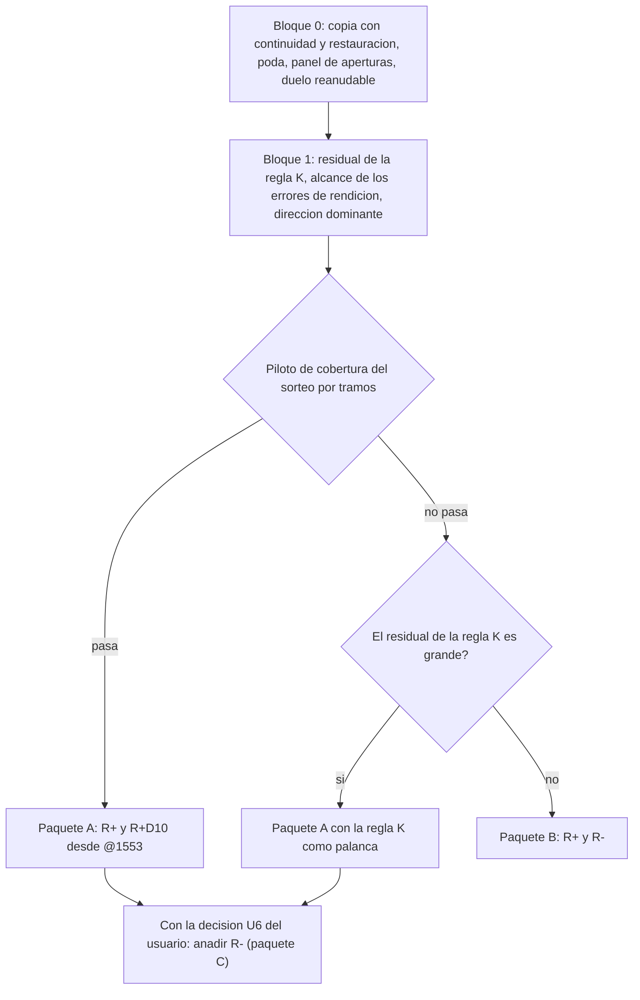
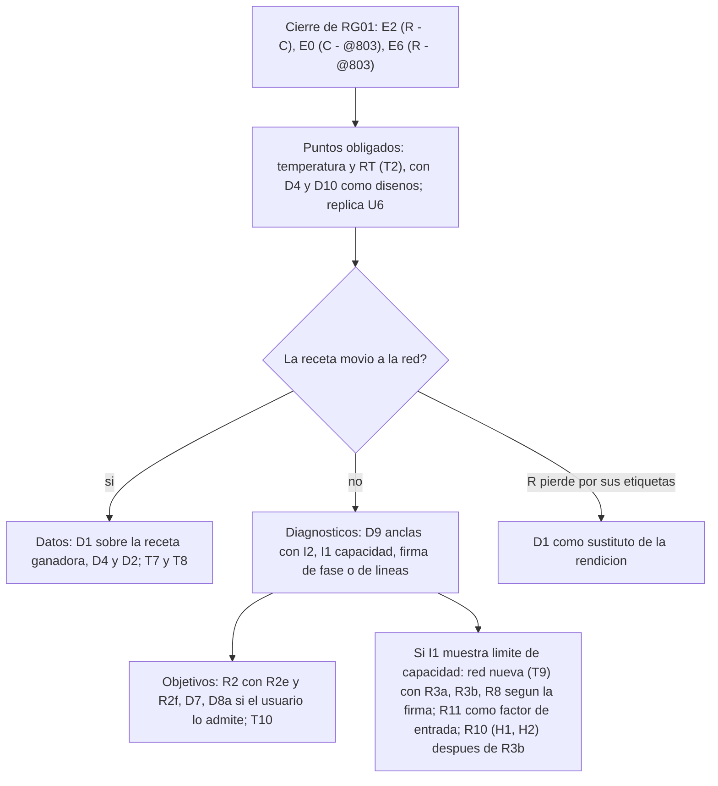
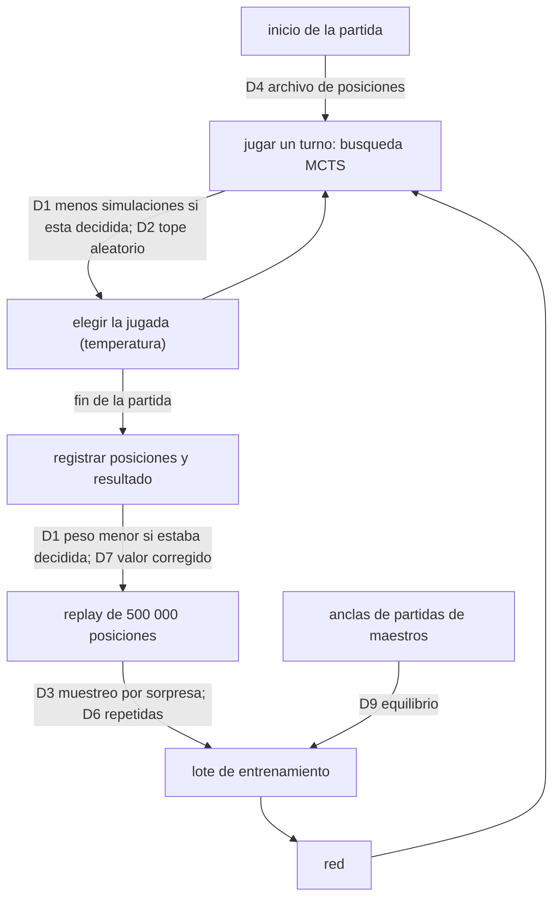
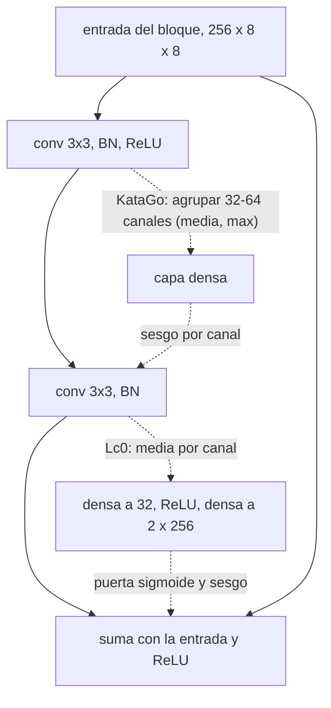
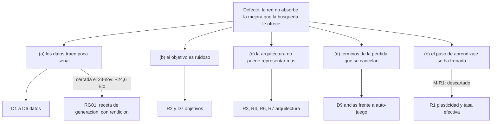

```mermaid
flowchart TD
    P["Bloque 0: copia con continuidad y restauracion, poda, panel de aperturas, duelo reanudable"] --> D["Bloque 1: residual de la regla K, alcance de los errores de rendicion, direccion dominante"]
    D --> Q{"Piloto de cobertura del sorteo por tramos"}
    Q -->|"pasa"| A["Paquete A: R+ y R+D10 desde @1553"]
    Q -->|"no pasa"| K{"El residual de la regla K es grande?"}
    K -->|"si"| A2["Paquete A con la regla K como palanca"]
    K -->|"no"| B["Paquete B: R+ y R-"]
    A --> U["Con la decision U6 del usuario: anadir R- (paquete C)"]
    A2 --> U
```

```mermaid
flowchart TD
    C["Cierre de RG01: E2 (R - C), E0 (C - @803), E6 (R - @803)"] --> P["Puntos obligados: temperatura y RT (T2), con D4 y D10 como disenos; replica U6"]
    P --> Q{"La receta movio a la red?"}
    Q -->|"si"| S["Datos: D1 sobre la receta ganadora, D4 y D2; T7 y T8"]
    Q -->|"no"| N["Diagnosticos: D9 anclas con I2, I1 capacidad, firma de fase o de lineas"]
    N --> O["Objetivos: R2 con R2e y R2f, D7, D8a si el usuario lo admite; T10"]
    N --> A["Si I1 muestra limite de capacidad: red nueva (T9) con R3a, R3b, R8 segun la firma; R11 como factor de entrada; R10 (H1, H2) despues de R3b"]
    Q -->|"R pierde por sus etiquetas"| K["D1 como sustituto de la rendicion"]
```

```mermaid
flowchart TD
    S["inicio de la partida"] -->|"D4 archivo de posiciones"| P["jugar un turno: busqueda MCTS"]
    P -->|"D1 menos simulaciones si esta decidida; D2 tope aleatorio"| M["elegir la jugada (temperatura)"]
    M --> P
    M -->|"fin de la partida"| R["registrar posiciones y resultado"]
    R -->|"D1 peso menor si estaba decidida; D7 valor corregido"| B["replay de 500 000 posiciones"]
    B -->|"D3 muestreo por sorpresa; D6 repetidas"| T["lote de entrenamiento"]
    A["anclas de partidas de maestros"] -->|"D9 equilibrio"| T
    T --> N["red"]
    N --> P
```

```mermaid
flowchart TD
    X["entrada del bloque, 256 x 8 x 8"] --> C1["conv 3x3, BN, ReLU"]
    C1 --> C2["conv 3x3, BN"]
    C2 --> SUM["suma con la entrada y ReLU"]
    X --> SUM
    C1 -.->|"KataGo: agrupar 32-64 canales (media, max)"| G["capa densa"]
    G -.->|"sesgo por canal"| C2
    C2 -.->|"Lc0: media por canal"| SE["densa a 32, ReLU, densa a 2 x 256"]
    SE -.->|"puerta sigmoide y sesgo"| SUM
```

```mermaid
flowchart TD
    D["Defecto: la red no absorbe la mejora que la busqueda le ofrece"] --> A["(a) los datos traen poca senal"]
    D --> B["(b) el objetivo es ruidoso"]
    D --> C["(c) la arquitectura no puede representar mas"]
    D --> E["(d) terminos de la perdida que se cancelan"]
    D --> F["(e) el paso de aprendizaje se ha frenado"]
    F -->|"M-R1: descartado"| R1["R1 plasticidad y tasa efectiva"]
    C --> R3["R3, R4, R6, R7 arquitectura"]
    B --> R2["R2 y D7 objetivos"]
    A --> DD["D1 a D6 datos"]
    E --> D9["D9 anclas frente a auto-juego"]
    A -->|"cerrada el 23-nov: +24,6 Elo"| RG["RG01: receta de generacion, con rendicion"]
```
