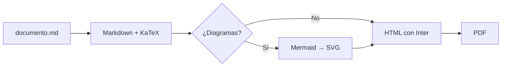
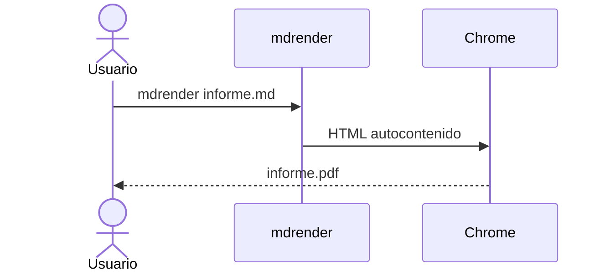

## Texto y formato

Párrafos con **negrita**, _cursiva_, ~~tachado~~, `código en línea` y enlaces como
https://github.com/imontene/MD_reder. Las notas al pie también funcionan[^1].

> [!TIP]
> Cambia el idioma de los títulos con `lang: en` en el front matter.

| Formato | Comando                         | Necesita navegador |
| :------ | :------------------------------ | :----------------: |
| PDF     | `mdrender doc.md`               |         Sí         |
| HTML    | `mdrender doc.md --format html` |  Solo con Mermaid  |

- [x] Tablas, listas de tareas y alertas
- [x] Ecuaciones y diagramas
- [ ] Tu próximo documento

## Ecuaciones

La fórmula de Euler $e^{i\pi} + 1 = 0$ en línea, y en bloque:

$$
\hat{f}(\xi) = \int_{-\infty}^{\infty} f(x)\, e^{-2\pi i x \xi}\, dx
$$

$$
\begin{aligned}
\nabla \cdot \mathbf{E} &= \frac{\rho}{\varepsilon_0} &
\nabla \times \mathbf{B} &= \mu_0 \mathbf{J} + \mu_0 \varepsilon_0 \frac{\partial \mathbf{E}}{\partial t}
\end{aligned}
$$

## Diagramas





## Código

```python
def fibonacci(n: int) -> list[int]:
    """Primeros n números de Fibonacci."""
    serie = [0, 1]
    while len(serie) < n:
        serie.append(serie[-1] + serie[-2])
    return serie[:n]
```

## Imágenes


[^1]: Las notas se numeran solas y se agrupan al final del documento.
