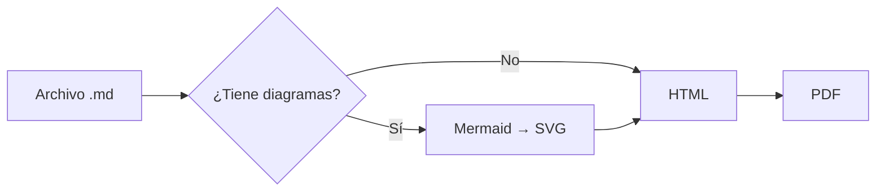
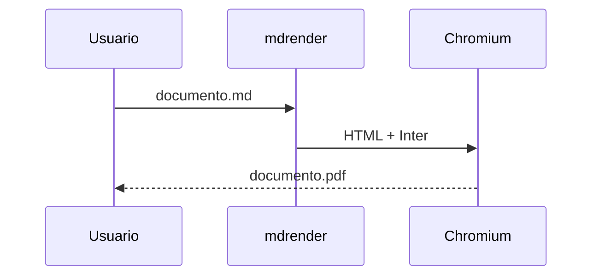
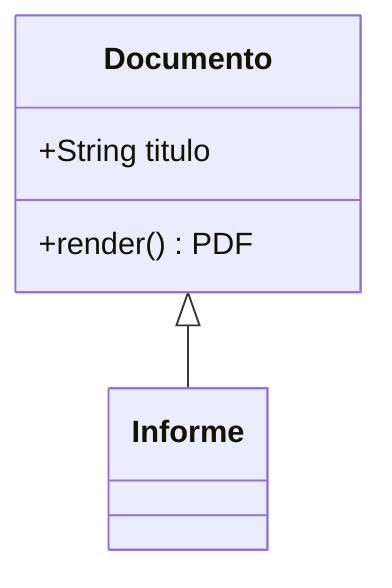
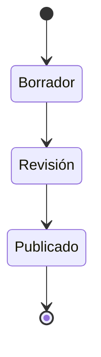
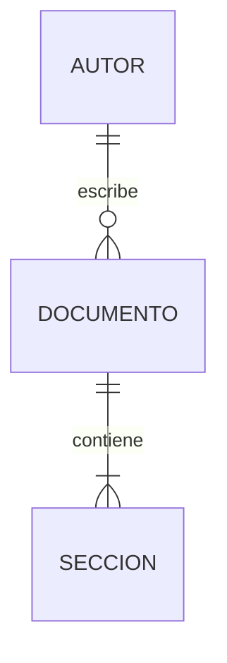
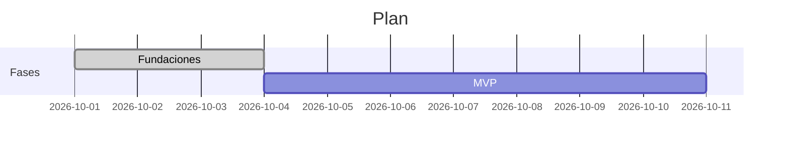
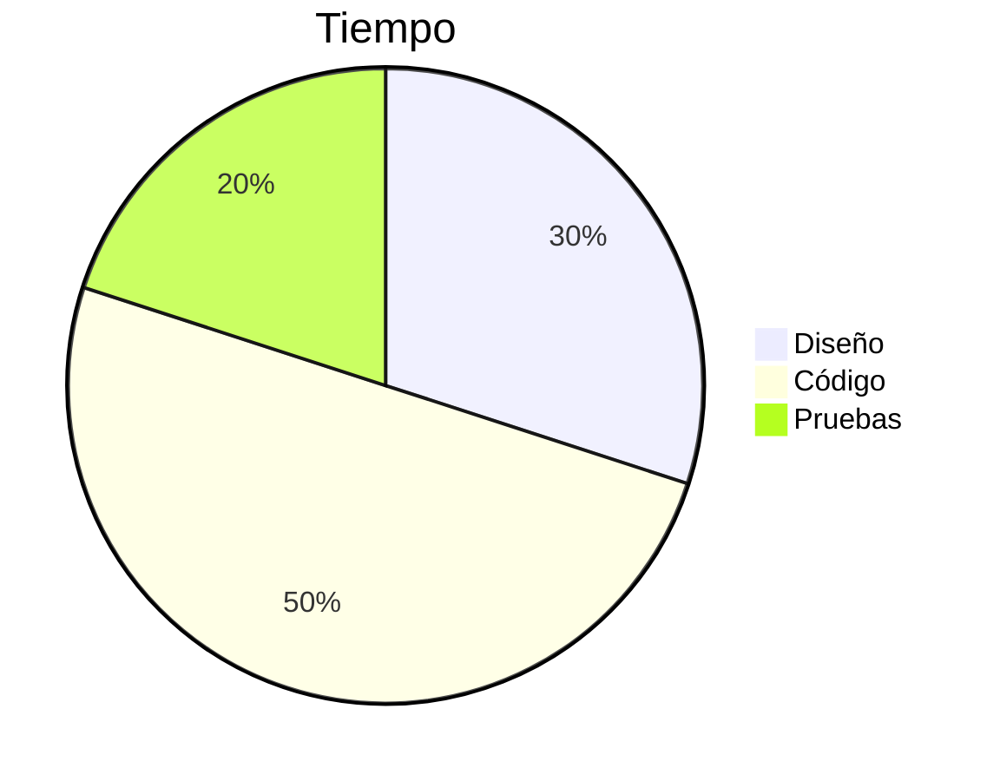
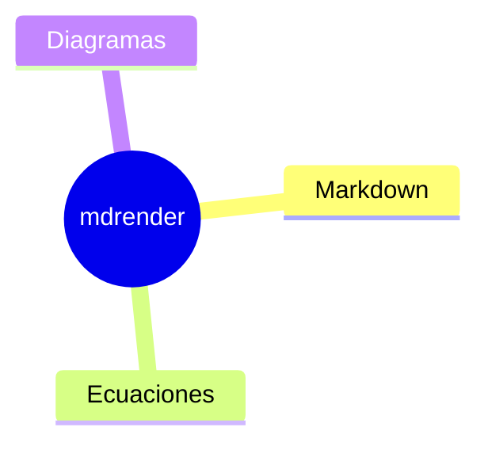

# Diagramas

## Flujo

```mermaid
flowchart LR
    A[Archivo .md] --> B{¿Tiene diagramas?}
    B -->|Sí| C[Mermaid → SVG]
    B -->|No| D[HTML]
    C --> D --> E[PDF]
```

## Secuencia

```mermaid
sequenceDiagram
    Usuario->>mdrender: documento.md
    mdrender->>Chromium: HTML + Inter
    Chromium-->>Usuario: documento.pdf
```

## Clases

```mermaid
classDiagram
    class Documento {
        +String titulo
        +render() PDF
    }
    Documento <|-- Informe
```

## Estados

```mermaid
stateDiagram-v2
    [*] --> Borrador
    Borrador --> Revisión
    Revisión --> Publicado
    Publicado --> [*]
```

## Entidad-relación

```mermaid
erDiagram
    AUTOR ||--o{ DOCUMENTO : escribe
    DOCUMENTO ||--|{ SECCION : contiene
```

## Gantt

```mermaid
gantt
    title Plan
    dateFormat YYYY-MM-DD
    section Fases
    Fundaciones :done, f0, 2026-10-01, 3d
    MVP         :f1, after f0, 7d
```

## Torta

```mermaid
pie title Tiempo
    "Diseño" : 30
    "Código" : 50
    "Pruebas" : 20
```

## Mapa mental

```mermaid
mindmap
  root((mdrender))
    Markdown
    Ecuaciones
    Diagramas
```
